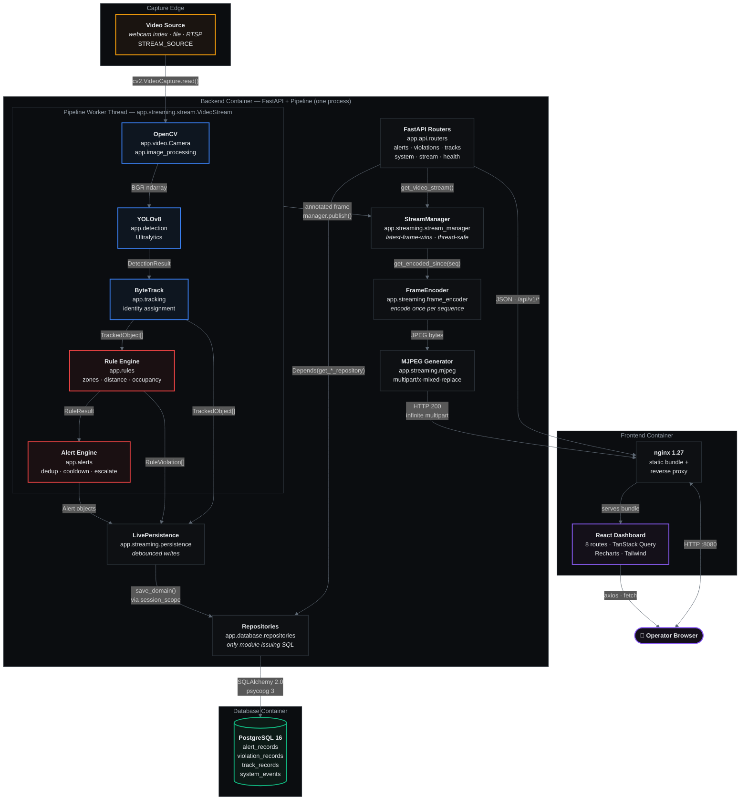

# 1 · High-Level System Architecture

Every element below is verified against the repository. Edge labels state the **actual
transport or call mechanism**, not a generic association.

## Communication matrix

| From | To | Mechanism | Verified at |
|:--|:--|:--|:--|
| Video source | OpenCV | `cv2.VideoCapture.read()` | `app/video/camera.py` |
| OpenCV | YOLOv8 | in-process call, BGR `ndarray` | `run_detection.py` · `SafetyPipeline.process_frame` |
| YOLOv8 | ByteTrack | `DetectionResult` object | `run_detection.py:process_frame` |
| ByteTrack | Rule Engine | `TrackedObject[]` (duck-typed) | `run_detection.py:process_frame` |
| Rule Engine | Alert Engine | `RuleResult` (duck-typed) | `persistence.py:record` |
| Pipeline | StreamManager | `manager.publish(annotated)` | `stream.py:384` |
| Pipeline | LivePersistence | `persistence.record(...)` | `stream.py:382` |
| LivePersistence | Repositories | `RepositoryBundle.for_session` | `persistence.py:97` |
| Repositories | PostgreSQL | SQLAlchemy 2.0 + psycopg 3 | `app/database/repositories.py` |
| StreamManager | MJPEG | `get_encoded_since(seq)` polling | `app/streaming/mjpeg.py` |
| Routers | Repositories | `Depends(get_*_repository)` | `app/api/dependencies.py` |
| Routers | StreamManager | `get_video_stream()` singleton | `app/api/routers/stream.py:65` |
| nginx | Backend | HTTP reverse proxy, `proxy_buffering off` for stream | `frontend/nginx.conf.template` |
| Browser | nginx | HTTP :8080 (single origin) | `docker-compose.yml` |

## Architectural invariants

1. **The pipeline runs inside the API process.** `StreamManager` is a process-wide singleton;
   frames produced by a separate `run_detection.py` process are *not* visible to the API.
2. **Only `repositories.py` issues SQL.** No router imports SQLAlchemy — verified by grep.
3. **The producer never blocks.** `publish()` never queues; encoding happens outside the
   producer's lock, so a slow viewer cannot throttle inference.
4. **Layers decouple by duck typing.** `rules` does not import `tracking`; `alerts` does not
   import `rules`. Confirmed by the import graph in [diagram 6](06-folder-dependencies.md).
