# 2 · End-to-End Data Flow

The complete journey of a single frame, with the **concrete type** carried on every edge.
Line numbers refer to the verified implementation.

```mermaid
%%{init: {'theme':'dark','themeVariables':{'fontFamily':'Inter,system-ui,sans-serif','fontSize':'13px','lineColor':'#5E6873','primaryTextColor':'#E6E9EC','clusterBkg':'#0B0D10','clusterBorder':'#2A3138','titleColor':'#98A2AC'}}}%%
flowchart TD
    A["🎥 <b>Video Source</b><br/><code>Camera.read&lpar;&rpar;</code>"]
    B["<b>Preprocess</b><br/><code>ImagePreprocessor</code><br/>resize · CLAHE<br/><i>stays uint8 BGR</i>"]
    C["<b>YOLOv8 Inference</b><br/><code>Detector.detect&lpar;&rpar;</code><br/>CUDA or CPU"]
    D["<b>ByteTrack</b><br/><code>Tracker.update&lpar;&rpar;</code><br/>identity assignment"]
    E["<b>Rule Evaluation</b><br/><code>RuleEngine.evaluate&lpar;&rpar;</code><br/>zones · distance · occupancy"]
    F["<b>Render Overlay</b><br/><code>pipeline.render&lpar;&rpar;</code><br/>boxes · IDs · zones · HUD"]

    G{"<b>LivePersistence.record</b><br/>debounce elapsed?"}
    H["<b>AlertManager.process</b><br/>group · dedup · cooldown<br/>escalate"]
    I["<b>Repositories</b><br/>tracks.save_domain<br/>alerts.save_domain<br/>violations.save_domain"]
    J[("🗄️ <b>PostgreSQL</b>")]

    K["<b>StreamManager.publish</b><br/>latest-frame-wins<br/><i>never blocks</i>"]
    L{"any viewer<br/>connected?"}
    M["<b>FrameEncoder</b><br/>JPEG · encode once<br/>per sequence"]
    N["<b>MJPEG generator</b><br/>multipart/x-mixed-replace"]

    O["<b>FastAPI Routers</b><br/>Depends&lpar;repository&rpar;"]
    P["<b>nginx</b><br/>proxy_buffering off"]
    Q["🖥️ <b>React Dashboard</b>"]
    R["<code>&lt;img src=/stream/live&gt;</code><br/>native browser decode"]
    S["<b>TanStack Query</b><br/>poll 10–30 s"]

    A -->|"BGR ndarray<br/>H×W×3 uint8"| B
    B -->|"resized BGR"| C
    C -->|"DetectionResult<br/>Detection[]"| D
    D -->|"TrackedObject[]<br/>stable track_id"| E
    E -->|"RuleResult<br/>RuleViolation[]"| F
    E -.->|"RuleResult"| G
    D -.->|"TrackedObject[]"| G
    F -->|"annotated ndarray"| K

    G -->|"yes"| H
    G -->|"no — skip write"| K
    H -->|"Alert[] &lpar;new only&rpar;"| I
    I -->|"session_scope&lpar;&rpar;<br/>SQLAlchemy · psycopg 3"| J

    K --> L
    L -->|"no — skip encode"| K
    L -->|"yes"| M
    M -->|"JPEG bytes<br/>cached by sequence"| N

    J -->|"SELECT via repository"| O
    N -->|"HTTP 200 infinite"| P
    O -->|"JSON + meta"| P
    P -->|"MJPEG"| R
    P -->|"JSON"| S
    R --> Q
    S --> Q

    classDef capture fill:#1a1410,stroke:#F59E0B,stroke-width:2px,color:#E6E9EC
    classDef vision fill:#0E1620,stroke:#3B82F6,stroke-width:2px,color:#E6E9EC
    classDef safety fill:#1a1012,stroke:#EF4444,stroke-width:2px,color:#E6E9EC
    classDef persist fill:#0d1a16,stroke:#10B981,stroke-width:2px,color:#E6E9EC
    classDef stream fill:#0E1013,stroke:#2A3138,stroke-width:1.5px,color:#E6E9EC
    classDef client fill:#141019,stroke:#8B5CF6,stroke-width:2px,color:#E6E9EC
    classDef gate fill:#16191D,stroke:#F59E0B,stroke-width:2px,color:#E6E9EC

    class A capture
    class B,C,D vision
    class E,F safety
    class H,I,J persist
    class K,M,N,O,P stream
    class Q,R,S client
    class G,L gate
```

## Two independent consumers, one producer

The frame fans out to two paths that **never block each other**:

| Path | Cost control | Consequence if slow |
|:--|:--|:--|
| **Persistence** → PostgreSQL | Time-based debounce; a session opens only for frames with something new | Writes are skipped, frames still stream |
| **Streaming** → viewers | Latest-frame-wins; encode skipped entirely with zero viewers | Viewers drop intermediate frames, inference is unaffected |

## Type contract along the pipeline

| Stage | Emits | Defined in |
|:--|:--|:--|
| `Camera.read()` | `np.ndarray` (H×W×3, uint8, BGR) | `app/video/camera.py` |
| `ImagePreprocessor.result()` | `np.ndarray` — **still uint8 BGR** | `app/image_processing/preprocessor.py` |
| `Detector.detect()` | `DetectionResult` → `Detection[]` → `BoundingBox` | `app/detection/detection_result.py` |
| `Tracker.update()` | `TrackedObject[]` with `track_id`, `BoundingBoxReference` | `app/tracking/tracked_object.py` |
| `RuleEngine.evaluate()` | `RuleResult` → `RuleViolation[]` with `Severity` | `app/rules/rule_result.py` |
| `AlertManager.process()` | `Alert[]` — **new incidents only** | `app/alerts/alert.py` |
| `pipeline.render()` | annotated `np.ndarray` | `run_detection.py` |
| `FrameEncoder.encode()` | JPEG `bytes` | `app/streaming/frame_encoder.py` |

> **Why preprocessing stays uint8 BGR:** `ImagePreprocessor` also offers `normalize()` and
> `to_rgb()`, but the pipeline deliberately does not use them — a float or channel-swapped
> frame would be misinterpreted by Ultralytics.
