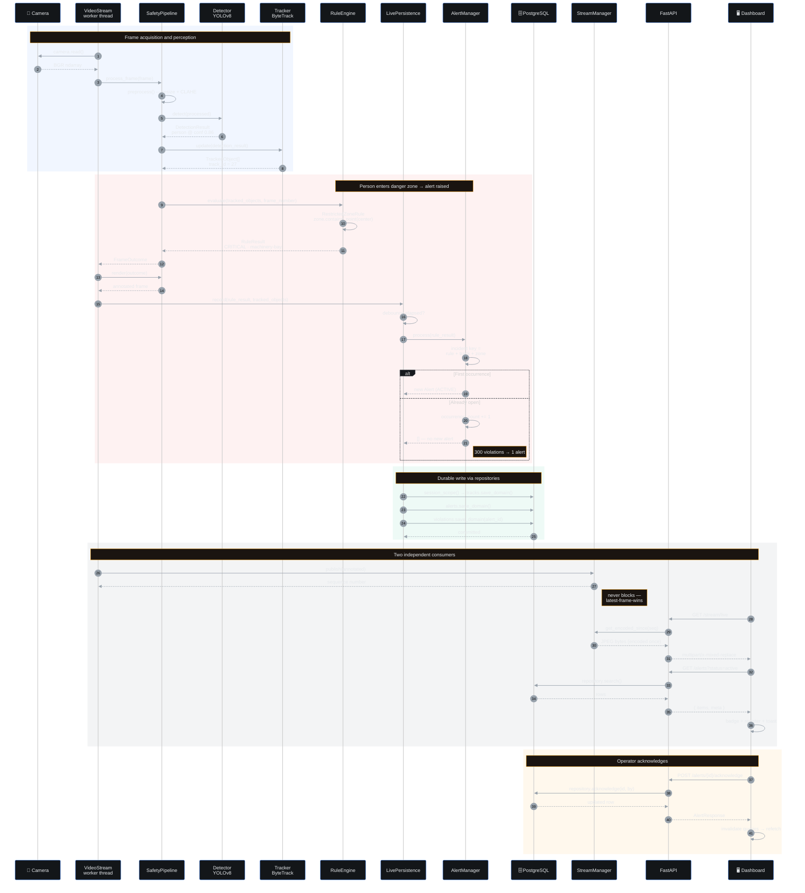

# 3 · Sequence — Zone Intrusion to Dashboard

What happens from a frame arriving to an operator seeing the alert. Method names and
ordering are taken from the implementation.

## Timing characteristics

| Step | Measured | Source |
|:--|:--:|:--|
| Detection + tracking | ~38 ms/frame | 24–26 fps observed, YOLOv8n @ 640×360, RTX 4050 |
| Rule evaluation | 0.02–0.21 ms | 3 active rules, logged per frame |
| `StreamManager.publish()` | 0.028 ms median · **0.108 ms p99** | 6 concurrent slow consumers |
| Dashboard alert poll | 10–30 s | TanStack Query `refetchInterval` |
| MJPEG delivery | ≤ 1/target_fps | Generator polls at half the frame interval |

## Deduplication in practice

The `alt` branch above is the system's defining behaviour. A person standing in a danger zone
for 10 s at 30 fps produces **300 `RuleViolation` objects** but exactly **one `Alert`** — the
rest increment `occurrence_count` on the open incident. Verified: **300 → 1**.
