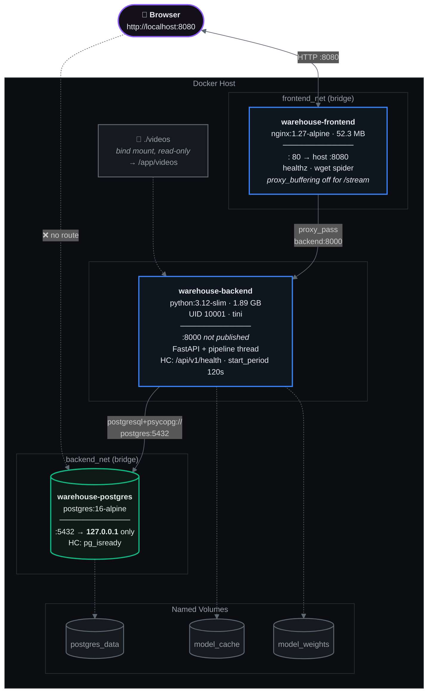
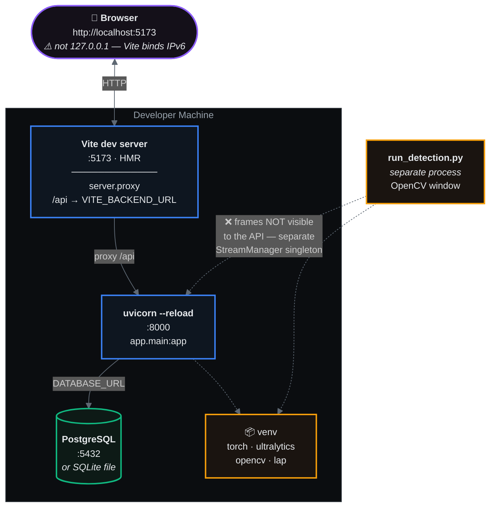

# 4 · Deployment Topology

Both supported modes. Ports, networks, volumes and healthchecks are taken from
`docker-compose.yml` and `vite.config.ts`.

## Docker deployment

### Health-gated startup

`depends_on` conditions mean nothing starts before its dependency is genuinely ready:

## Local development

## Mode comparison

| Aspect | Docker | Local |
|:--|:--|:--|
| Entry point | nginx :8080 | Vite :5173 |
| API reachability | Internal only — not published | Direct on :8000 |
| Cross-origin | Same origin via nginx | Vite `server.proxy` |
| MJPEG buffering | `proxy_buffering off` required | Vite proxy passes through |
| Database | `postgres` service on `backend_net` | Local PostgreSQL or SQLite |
| Schema creation | Entrypoint (`RUN_MIGRATIONS`) | Manual `initialize()` |
| Webcam | ⚠️ Linux hosts only — Docker Desktop cannot pass USB devices | Native support |
| GPU | Requires NVIDIA Container Toolkit + `docker-compose.gpu.yml` | Native CUDA |

## Network isolation

Two bridge networks rather than one. The **frontend has no route to PostgreSQL** — only the
backend joins both. The backend publishes no host port, so `:8080` is the single entry point
to secure.
