# 5 · Backend Component Diagram

Every module and its public entry points, verified against the source. Class and function
names are exactly as implemented.

```mermaid
%%{init: {'theme':'dark','themeVariables':{'fontFamily':'Inter,system-ui,sans-serif','fontSize':'12px','lineColor':'#5E6873','primaryTextColor':'#E6E9EC','clusterBkg':'#0B0D10','clusterBorder':'#2A3138','titleColor':'#98A2AC'}}}%%
flowchart TB
    subgraph API["app.api — REST layer"]
        direction TB
        R_A["<b>routers/alerts.py</b><br/>list · get · search<br/>acknowledge · resolve"]
        R_V["<b>routers/violations.py</b>"]
        R_T["<b>routers/tracks.py</b>"]
        R_S["<b>routers/system.py</b>"]
        R_ST["<b>routers/stream.py</b><br/>live · snapshot · status"]
        R_H["<b>routers/health.py</b>"]
        DEP["<b>dependencies.py</b><br/>get_session<br/>get_*_repository<br/>PaginationParams · SortParams"]
        SCH["<b>schemas.py</b><br/>Pydantic v2 contract"]
        EXC["<b>exceptions.py</b><br/>single error envelope<br/>503 on DB fault"]
    end

    subgraph STREAM["app.streaming"]
        direction TB
        VSTREAM["<b>stream.py</b><br/>VideoStream · StreamConfig<br/>worker thread"]
        SMGR["<b>stream_manager.py</b><br/>StreamManager<br/>publish · get_encoded_since"]
        FENC["<b>frame_encoder.py</b><br/>FrameEncoder<br/>EncoderConfig"]
        MJP["<b>mjpeg.py</b><br/>mjpeg_stream · snapshot<br/>build_frame_part"]
        LPERS["<b>persistence.py</b><br/>LivePersistence.record"]
    end

    subgraph ALERTS["app.alerts"]
        direction TB
        AMGR["<b>alert_manager.py</b><br/>AlertManager<br/>process · acknowledge · resolve"]
        AENG["<b>alert_engine.py</b><br/>AlertEngine<br/>dedup · escalate"]
        ACOOL["<b>cooldown.py</b><br/>CooldownTracker"]
        AHIST["<b>alert_history.py</b><br/>AlertHistory"]
        ANOT["<b>notification_policy.py</b><br/>NotificationPolicy<br/><i>decisions only</i>"]
        AMOD["<b>alert.py</b><br/>Alert · AlertLevel<br/>AlertStatus · AlertCategory"]
    end

    subgraph RULES["app.rules"]
        direction TB
        RENG["<b>rule_engine.py</b><br/>RuleEngine.evaluate"]
        RREG["<b>rule_registry.py</b><br/>RuleRegistry"]
        RSAFE["<b>safety_rules.py</b><br/>RestrictedZoneRule<br/>MinimumDistanceRule<br/>MaximumWorkersRule<br/>PPEPlaceholderRule"]
        RZONE["<b>zone.py</b><br/>RectangleZone · PolygonZone<br/>ZoneType"]
        RBASE["<b>rule.py</b><br/>BaseRule · RuleContext"]
        RRES["<b>rule_result.py</b><br/>Severity · RuleViolation<br/>RuleResult"]
    end

    subgraph TRACK["app.tracking"]
        direction TB
        TTRK["<b>tracker.py</b><br/>Tracker.update"]
        TBT["<b>bytetrack_engine.py</b><br/>ByteTrackEngine<br/>_DetectionAdapter"]
        TOBJ["<b>tracked_object.py</b><br/>TrackedObject<br/>TrackHistory · TrackState"]
        TUTL["<b>tracker_utils.py</b><br/>coordinate conversions"]
    end

    subgraph DETECT["app.detection"]
        direction TB
        DDET["<b>detector.py</b><br/>Detector.detect"]
        DENG["<b>yolo_engine.py</b><br/>YOLOEngine"]
        DLOAD["<b>model_loader.py</b><br/>load_model · get_best_device<br/><i>thread-safe cache</i>"]
        DRES["<b>detection_result.py</b><br/>BoundingBox · Detection<br/>DetectionResult"]
    end

    subgraph VIDEO["app.video"]
        direction TB
        VCAM["<b>camera.py</b><br/>Camera · CameraError"]
        VRD["<b>video_reader.py</b><br/>VideoReader"]
        VFPS["<b>fps.py</b><br/>FPSCounter"]
    end

    subgraph IMG["app.image_processing"]
        IPRE["<b>preprocessor.py</b><br/>ImagePreprocessor"]
        IUTL["<b>image_utils.py</b>"]
        IAUG["<b>augmentations.py</b>"]
    end

    subgraph DB["app.database"]
        direction TB
        DBREPO["<b>repositories.py</b><br/>AlertRepository<br/>ViolationRepository<br/>TrackRepository<br/>SystemRepository<br/>RepositoryBundle"]
        DBSESS["<b>session.py</b><br/>SessionManager<br/>session_scope"]
        DBENG["<b>database.py</b><br/>Database · DatabaseConfig<br/><i>lazy engine</i>"]
        DBMOD["<b>models.py</b><br/>AlertRecord · ViolationRecord<br/>TrackRecord · SystemEvent"]
        DBMIG["<b>migrations.py</b><br/>initialize · create_schema"]
        DBSEED["<b>seed.py</b>"]
    end

    PIPE["<b>run_detection.py</b><br/><i>backend root — composition point</i><br/>SafetyPipeline · PipelineConfig"]
    PG[("PostgreSQL")]

    R_A & R_V & R_T & R_S --> DEP
    R_ST --> VSTREAM
    R_ST --> SMGR
    R_H --> DBENG
    DEP --> DBREPO
    DEP --> DBSESS
    R_A -.-> SCH

    VSTREAM -->|"lazy import"| PIPE
    VSTREAM --> SMGR
    VSTREAM --> LPERS
    VSTREAM --> VCAM
    SMGR --> FENC
    MJP --> SMGR
    LPERS --> AMGR
    LPERS --> DBREPO
    LPERS --> DBSESS

    PIPE --> IPRE
    PIPE --> DDET
    PIPE --> TTRK
    PIPE --> RENG
    PIPE --> VCAM
    PIPE --> VFPS

    DDET --> DENG --> DLOAD
    DENG -.-> DRES
    TTRK --> TBT
    TBT -.-> TOBJ
    TBT --> TUTL
    RENG --> RREG --> RSAFE
    RSAFE --> RZONE
    RSAFE -.-> RBASE
    RENG -.-> RRES
    AMGR --> AENG --> ACOOL
    AMGR --> AHIST
    AMGR --> ANOT
    AENG -.-> AMOD

    DBREPO --> DBMOD
    DBSESS --> DBENG
    DBMIG --> DBMOD
    DBSEED --> DBREPO
    DBREPO -->|"SQLAlchemy"| PG

    classDef api fill:#0E1620,stroke:#3B82F6,stroke-width:2px,color:#E6E9EC
    classDef stream fill:#101418,stroke:#5E6873,stroke-width:2px,color:#E6E9EC
    classDef safety fill:#1a1012,stroke:#EF4444,stroke-width:2px,color:#E6E9EC
    classDef vision fill:#12161c,stroke:#3B82F6,stroke-width:1.5px,color:#E6E9EC
    classDef store fill:#0d1a16,stroke:#10B981,stroke-width:2px,color:#E6E9EC
    classDef comp fill:#1a1410,stroke:#F59E0B,stroke-width:2px,color:#E6E9EC

    class R_A,R_V,R_T,R_S,R_ST,R_H,DEP,SCH,EXC api
    class VSTREAM,SMGR,FENC,MJP,LPERS stream
    class AMGR,AENG,ACOOL,AHIST,ANOT,AMOD,RENG,RREG,RSAFE,RZONE,RBASE,RRES safety
    class TTRK,TBT,TOBJ,TUTL,DDET,DENG,DLOAD,DRES,VCAM,VRD,VFPS,IPRE,IUTL,IAUG vision
    class DBREPO,DBSESS,DBENG,DBMOD,DBMIG,DBSEED,PG store
    class PIPE comp
```

## Module responsibilities

| Module | Owns | Explicitly does **not** |
|:--|:--|:--|
| `app.video` | Capture, frame reading, FPS | Detect, draw, persist |
| `app.image_processing` | Preprocessing chains | Model dependency |
| `app.detection` | YOLO loading + inference | Track, draw, evaluate rules |
| `app.tracking` | Identity assignment, history | Detect, evaluate rules |
| `app.rules` | Zone geometry, rule evaluation | Fetch, draw, persist |
| `app.alerts` | Incident lifecycle, dedup, routing decisions | Deliver notifications, write SQL |
| `app.streaming` | Frame hand-off, JPEG, MJPEG, live persistence | Own the pipeline (imports it) |
| `app.database` | Engine, sessions, ORM, repositories | Contain business logic |
| `app.api` | HTTP contract, DI, error envelope | Import SQLAlchemy or build queries |
| `run_detection.py` | **Composition root** — wires all stages | Live in `app/` |

> **`run_detection.py` is the composition point.** No module inside `app/` imports
> `detection`, `tracking` or `rules` — they are wired together at the backend root by
> `SafetyPipeline`, which `app.streaming.stream` imports lazily. This keeps `app.streaming`
> importable without Torch present.
