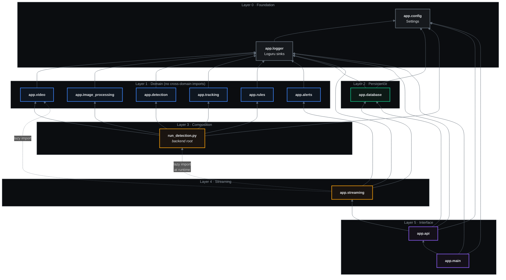

# 6 · Folder Dependency Graph

**Machine-derived.** Produced by extracting every `from app.X import ...` statement across
the backend, so it shows the dependencies that actually exist — not the intended ones.

```bash
# Reproduce:
for f in $(find app -name "*.py" -not -path "*__pycache__*"); do
  mod=$(echo "$f" | sed 's|app/||; s|/[^/]*\.py$||; s|\.py$||')
  grep -oE "^from app\.[a-z_]+" "$f" | sed "s|^from app\.|$mod -> |"
done | sort -u
```



## Verified dependency table

Complete output of the extraction script. Self-references (package `__init__` re-exports) are
omitted.

| Module | Depends on | Notes |
|:--|:--|:--|
| `app.logger` | `config` | |
| `app.video` | `logger` | |
| `app.image_processing` | `logger` | |
| `app.detection` | `logger` | |
| `app.tracking` | `logger` | **Does not import `detection`** |
| `app.rules` | `logger` | **Does not import `tracking`** |
| `app.alerts` | `logger` | **Does not import `rules`** |
| `app.database` | `config`, `logger` | |
| `app.streaming` | `alerts`, `database`, `logger` | + lazy `run_detection`, `video` |
| `app.api` | `database`, `logger` | |
| `app.api.routers` | `api`, `config`, `database`, `logger`, `streaming` | |
| `app.main` | `api`, `config`, `logger` | |
| `run_detection.py` | `config`, `detection`, `image_processing`, `logger`, `rules`, `tracking`, `video` | Composition root |

## What the graph proves

### ✅ Acyclic
Every edge points from a higher layer to a lower one. No cycles.

### ✅ Domain modules are siblings, not a chain
`detection`, `tracking`, `rules` and `alerts` each depend only on `logger`. They are wired
together by **duck typing** at the composition root:

| Consumer | Reads structurally | Never imports |
|:--|:--|:--|
| `tracking.tracker_utils` | `.bounding_box.x1/.y1/.x2/.y2`, `.confidence`, `.class_id` | `app.detection` |
| `rules.rule` | `.track_id`, `.class_name`, `.bounding_box`, `.center` | `app.tracking` |
| `alerts.alert_engine` | `.severity`, `.rule_name`, `.description`, `.metadata` | `app.rules` |

Each layer can be replaced independently — swapping ByteTrack for DeepSORT touches only
`app.tracking`.

### ✅ Persistence is a leaf
`app.database` depends on nothing in the domain. Domain objects reach it through
`save_domain()` mappers that duck-type their input, so the ORM never leaks upward.

### ⚠️ One deliberate inversion
`app.streaming` imports `run_detection` (a higher layer) **lazily, inside a method**:

```python
# app/streaming/stream.py — inside VideoStream._build_pipeline()
from run_detection import PipelineConfig, SafetyPipeline
```

This is intentional and documented in the module. Reusing the existing `SafetyPipeline`
avoids reimplementing the detect → track → evaluate chain, and the lazy import keeps
`app.streaming` — and therefore the whole API — importable on machines with no Torch, no
OpenCV and no GPU.
